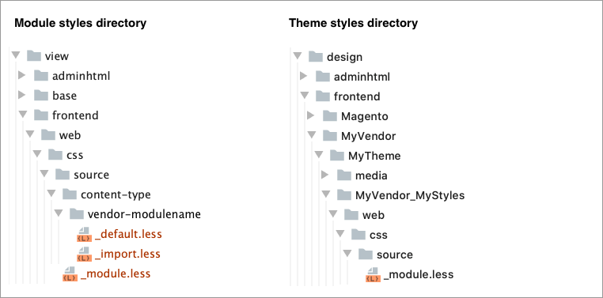

# How to override styles

To customize or override a Page Builder style assigned to a content type, we recommend creating a CSS selector that targets the content type by using a custom class, as follows:

-  `html-body` id
-  `data-content-type` attribute
-  your custom CSS class

For example, if you wanted to override the Heading content type, the selector for your CSS class should follow this pattern:


This CSS selector results in a CSS specificity value of 120, which overrides the 110 specificity for Page Builder styles, while keeping the specificity relatively low for any additional overrides, as needed.

In addition, you need to add your CSS class (or classes) to the content type. You can do this by adding your class names to the content type's **CSS Classes** field in the editor. For this example, you would add `theme-headings` to the field in the Headings editor, as shown:


## Where to add your CSS

To extend or override Page Builder styles, add your custom CSS classes to any of the following locations:

-  **Page Builder module** `adminhtml` area
-  **Page Builder module** `frontend` area
-  **Magento Theme** `.less` files (for storefront theming)
-  **HTML Code** content type (for testing and development)

The reasons for adding your overrides to one or more of these locations are described next.

### Overriding Admin styles (adminhtml)

To override Page Builder styles applied to content types on the Admin stage, add or import your CSS styles to the `_module.less` file in your module's `adminhtml` area: `/view/adminhtml/web/css/source/_module.less`.

### Overriding storefront styles (frontend)

To override Page Builder styles applied to content types displayed on a storefront, add or import your CSS styles to the `_module.less` file in your module's `frontend` area: `/view/frontend/web/css/source/_module.less`.

### Overriding storefront styles in Themes

To override Page Builder styles as part of your theme, add or import your styles to your theme's `.less` files.

Defining your Page Builder styles and overrides in the `_module.less` file of a frontend Theme module ensures that your Page Builder theme styles will override the same-specificity styles defined in your Page Builder modules.

For detailed information on adding CSS and LESS styles to your themes, see:

-  [Simple ways to customize a theme's styles]({{ site.baseurl }}/guides/v2.4/frontend-dev-guide/css-guide/css_quick_guide_approach.html)

-  [Override module styles with theme styles]({{ site.baseurl }}/guides/v2.4/frontend-dev-guide/css-guide/css_quick_guide_approach.html#override-module-styles).

### Overriding styles during development and testing

To quickly develop and test custom CSS overrides before moving them to your modules and themes, you can drag an HTML Code content type to the page you are developing, then add your custom CSS styles to a `<style>` block in the WYSIWYG editor.


Using HTML Code in this way creates an internal stylesheet (on the page) that overrides any same-specificity CSS defined in the external stylesheets of your theme and module. This can be handy when you want to test changes for existing theme and module styles without having to recompile `.less` files.

## Steps for adding CSS to modules and themes

1. Create one of the following directory structures within your own Page Builder module or Magento theme.

    

    This module directory structure shows only the `frontend` area of a Page Builder module. However, the same directory structure applies to the `adminhtml` area when you want to style the content type for the Admin stage view.

2. Add a `.less` file named `_module.less` to the `web/css/source/` directory, as shown in step 1.

    By convention, Magento merges the CSS/LESS imported in `_module.less` with all the other CSS in the `pub/static` directory: `styles-m.css` and `styles-l.css`.

3. Add your custom CSS rulesets to your `.less` files. The simple ruleset below is for a custom content type named `vendor_modulename`:

    ```css
    #html-body [data-content-type='vendor_modulename'].my-css-class {
        display: flex;
        justify-content: center;
        align-items: center;
        color: blue;
    }
    ```

    In this example, we use the `#html-body` id from the `<body>` element of all Magento storefront pages, coupled with an attribute (`data-content-type`) that targets our custom content type, and finally your own CSS class. The combination of the id, attribute, and class increases the CSS specificity to 1-2-0, high enough to override Page Builder's CSS specificity of 1-1-0.

4. Add your custom CSS class name to the CSS Classes field for the content type. This ensures that Page Builder includes your CSS class name in the DOM of the content type.

    

That's it. The browser does the rest, resulting in a clean override of Page Builder's native styling.

To learn how the details of how Page Builder styles all content types, see [How Page Builder styles content](how-pagebuilder-styles-content.md).
