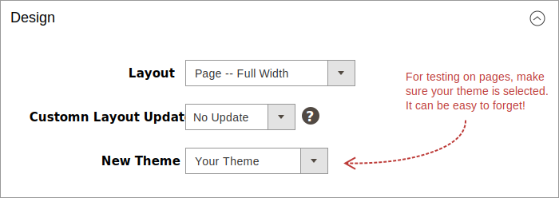

# Override Page Builder styles in themes

The best place to override Page Builder's default styles is within themes. CSS selectors within themes take precedence over the same CSS selectors in modules. This behavior reinforces the Magento convention of using themes to style your module content whenever possible.

Use Admin themes to override Page Builder's default admin styles. And use frontend themes to override Page Builder's default storefront styles.

## Use Admin themes

To override Page Builder styles in the Admin, you need to:

1. Create an Admin theme.
2. Apply the Admin theme to a module.

### Step 1: Create an Admin theme

Your first step is to create an Admin theme with the following directory and file structure. See [Create an Admin theme]({{ site.baseurl }}/guides/v2.4/frontend-dev-guide/themes/admin_theme_create.html) for more details:


_Admin theme directory structure_

The key takeaways are numbered in the image and described as follows:

1. **Content types**. Organize your overriding styles according to the Page Builder content-type names you want to override. In this example, we added a `pagebuilder` directory in `source` where we have added `heading` and `products` directories for the content types we want to override.

2. **Overriding stylesheets**. Name your overriding `.less` files to match the appearances of the content types you are overriding. In this example, the `heading` content type has one appearance: `default`. However, the `products` content type has two appearances `default` and `carousel`, so we create one `.less` file for each. This naming convention helps you find your overriding styles later when you need to update them.

3. **Import files**. Include an `_import.less` file for each content type directory. This file should only contain `@import` statements for all the overriding files in the directory. Using import files like this helps keep your changes closer to where they occur. In our example, the `_import.less` file for our `products` content type contains two imports:

    ```scss
    @import '_default.less';
    @import '_carousel.less';
    ```

4. **_module.less**. The `_module.less` file is required and must be added directly to your admin theme's `source` directory. Magento uses this file to add your admin styles to the `pub/static/adminhtml` output, where they can override default admin styles, including Page Builder's default content-type styles. Like the `_import.less` files, the `_module.less` file should only contain `@import` statements. In our example, our `_module.less` contains two imports:

    ```scss
    @import 'pagebuilder/heading/_import.less';
    @import 'pagebuilder/products/_import.less';
    ```

### Step 2: Apply the Admin theme to a module

After creating the Admin theme, you need to apply it to a custom Page Builder module. See [Apply an Admin theme]({{ site.baseurl }}/guides/v2.4/frontend-dev-guide/themes/admin_theme_apply.html) for complete details.

**To apply your Admin theme to a module**:

1. Create a `di.xml` file (in your module's `etc` directory) that references your Admin theme. The following example adds the `Vendor/ThemeName` Admin theme we created in step 1:

    ```xml
    <?xml version="1.0"?>
    <config xmlns:xsi="http://www.w3.org/2001/XMLSchema-instance" xsi:noNamespaceSchemaLocation="urn:magento:framework:ObjectManager/etc/config.xsd">

        <!-- Admin theme -->
        <type name="Magento\Theme\Model\View\Design">
            <arguments>
                <argument name="themes" xsi:type="array">
                    <item name="adminhtml" xsi:type="string">Vendor/ThemeName</item>
                </argument>
            </arguments>
        </type>

    </config>
    ```

2. Upgrade your module, clean cache, and reload the Admin in the browser:

    ```bash
    bin/magento setup:upgrade
    ```

    ```bash
    bin/magento cache:clean
    ```

## Use frontend themes

To override Page Builder styles on the storefront, you need to:

1. Create a frontend theme.
2. Apply the frontend theme in the Admin.

### Step 1: Create a frontend theme

Your first step is to create a frontend theme with the following directory and file structure. See [Create a new storefront theme]({{ site.baseurl }}/guides/v2.4/frontend-dev-guide/themes/theme-create.html) for all the details:


_Frontend theme directory structure_

The first three numbered callouts (1, 2, 3) in the frontend theme directory structure are identical to those described for the [admin theme](#admin-themes) previously. The only difference is the file name to use for your frontend theme's master import file: `_extend.less`.

1. **_extend.less**. The `_extend.less` file is required and must be added directly to your frontend theme's `source` directory. Magento uses this file to add your frontend styles to the `pub/static/frontend` output in a location within the `styles-m.css` where they override (instead of replace) the default frontend styles, including Page Builder's default content-type styles. Like the `_import.less` files, the `_extend.less` file should only contain `@import` statements. In our example, our `_extend.less` contains the same two imports as seen in `module.less`:

    ```scss
    @import 'pagebuilder/heading/_import.less';
    @import 'pagebuilder/products/_import.less';
    ```

### Step 2: Apply the frontend theme in the Admin

After creating the frontend theme, you need to apply it to one or more of your store views. You can can also apply it specifically to a page. See [Apply a storefront theme]({{ site.baseurl }}/guides/v2.4/frontend-dev-guide/themes/theme-apply.html) for all the details.

**To apply your frontend theme to a store view**:

Navigate to Content > Design > Configuration and edit the store view where you can apply your frontend theme as the default theme:


_Set default frontend theme for store view_

**To apply your frontend theme to a page**:

Open a new or existing CMS page, scroll to the Design section at the bottom, and select your theme from the New Theme selector.


_Set frontend theme for page_


## More about themes

For additional information on creating and applying themes, as well as overriding module styles with themes, see these additional topics:

-  [Simple ways to customize a theme's styles]({{ site.baseurl }}/guides/v2.4/frontend-dev-guide/css-guide/css_quick_guide_approach.html)

-  [Override module styles with theme styles]({{ site.baseurl }}/guides/v2.4/frontend-dev-guide/css-guide/css_quick_guide_approach.html#override-module-styles)
